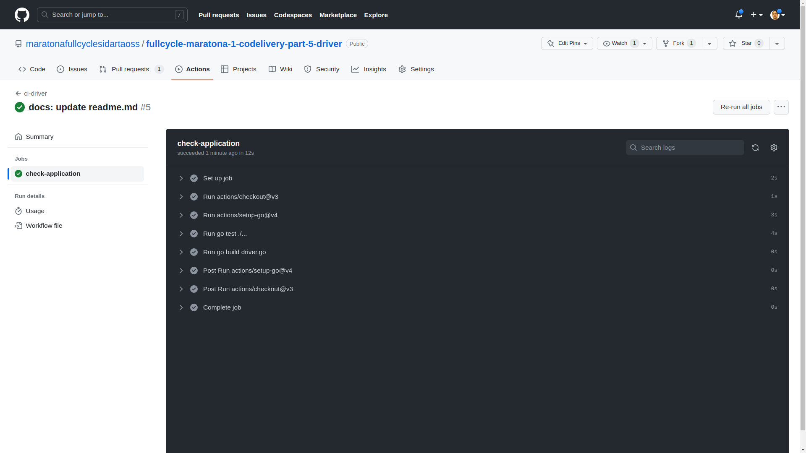

# Maratona Full Cycle - Codelivery - Part V - Driver - CI/CD

O projeto consiste em:

- Um sistema de monitoramento de veículos de entrega em tempo real.

Requisitos:

- Uma transportadora quer fazer o agendamento de suas entregas;
- Ela também quer ter o _feedback_ instantâneo de quando a entrega é realizada;
- Caso haja necessidade de acompanhar a entrega com mais detalhes, o sistema deverá informar, em tempo real, a localização do motorista no mapa.

#### Que problemas de negócio o projeto poderia resolver?

- O projeto pode ser adaptado para casos de uso onde é necessário rastrear e monitorar carros, caminhões, frotas e remessas em tempo real, como na logística e na indústria automotiva.

Dinâmica do sistema:

1. A aplicação _Order_ (_React_/_Nest.js_) é responsável pelas ordens de serviço (ou pedidos) e vai conter a tela de agendamento de pedidos de entrega. A criação de uma nova ordem de serviço começa o processo para que o motorista entregue a mercadoria;

2. A aplicação _Driver_ (_Go_) é responsável por gerenciar o contexto limitado de motoristas. Neste caso, sua responsabilidade consiste em disponibilizar os _endpoints_ de consulta;

3. Para a criação de uma nova ordem de serviço, a aplicação _Order_ obtém de _Driver_ os dados dos motoristas. Neste caso, _REST_ é uma opção pertinente, porque a comunicação deve ser a mais simples possível;

4. Após criar a nova ordem de serviço, _Order_ notifica a aplicação _Mapping_ (_Nest.js_/_React_) via _RabbitMQ_ de que o motorista deve iniciar a entrega. _Mapping_ é a aplicação que vai exibir no mapa a posição do motorista em tempo real. A aplicação _Simulator_ (_Go_) também é notificada sobre o início da entrega e começa a enviar para a aplicação _Mapping_ as posições do veículo;

5. Ao finalizar a entrega, a aplicação _Mapping_ notifica via _RabbitMQ_ a aplicação _Order_ de que o produto foi entregue e a aplicação altera o _status_ da entrega de Pendente para Entregue.

## Tecnologias

#### Operate What You Build

Nesta quinta versão, trabalhamos a parte de _Continuous Integration_ e _Continuous Deploy_. Iniciamos pela aplicação Driver.

- Backend

  - Golang

- Continuous Integration (_CI_)

  - GitHub Actions

- Continuous Deploy (_CD_)

  - Google Cloud Build

- Deploy

  - Kubernetes GKE

- Infrastructure as Code (_IaC_)

  - Terraform

### O que faremos

O objetivo deste projeto é cobrir um processo simples de desenvolvimento do início ao fim, desde:

- A utilização de uma metodologia para se trabalhar com o Git - o GitFlow;
- A adoção de Conventional Commits como especificação para as mensagens de commits;
- A adoção de Semantical Versioning (SemVer) como convenção para o versionamento de versões do software;

Até a definição de:

- Pipelines de Integração Contínua;
- Pipelines de Entrega Contínua;

Realizando, por fim:

- O deploy da aplicação em um cluster Kubernetes junto a um cloud provider.

Assim, seguiremos uma seqüência de passos:

1. Utilização da metodologia de Git Flow;
2. Definição de um nova Organização no GitHub;
3. Configuração de branches no GitHub;

- Filtros por branches;
- Proteção do branch master para evitar push direto;

4. Configuração de Pull Requests (PRs) no GitHub;

- Templates para PRs;

5. Configuração de Code Review no GitHub;
6. Configuração de CODEOWNERS no GitHub;
7. GitHub Actions;
8. Integração do SonarCloud Scan (Linter) ao GitHub Actions;
9. Provisionamento de um cluster GKE utilizando Terraform;
10. Deploy da aplicação utilizando o Google Cloud Build integrado ao GitHub Actions;

### Utilização da metodologia de Git Flow

- Qual é o problema que o Git Flow resolve?

Na verdade, o Git Flow é uma metodologia de trabalho que visa simplificar e organizar o processo que envolve o versionamento de código-fonte. Portanto, ele resolve um conjunto de problemas, como, por exemplo:

- Como definir um branch para uma correção?
- Como definir um branch para uma funcionalidade nova?
- Como saber se uma funcionalidade nova ainda está em desenvolvimento ou foi concluída?
- Como saber se o que está no branch master é o mesmo que está em Produção?
- Como saber se existe um branch de desenvolvimento?

Vejamos, então, dois cenários deste projeto aonde será empregado o Git Flow.

#### Cenário I

Neste cenário, há a definição de um _branch master_, também conhecido como _o branch da verdade_, porque, normalmente, o que está no _master_ equivale ao que está em Produção.

O Git Flow recomenda que não se commita diretamente no _branch master_. O _master_ não deve ser um local onde se consolidam todas as novas funcionalidades.

Então, o Git Flow define um branch auxiliar para que, quando todas as funcionalidades novas forem agregadas no branch auxiliar, aí sim elas são jogadas para o branch master. Esse branch auxiliar é chamado de _develop_.

O Git Flow define também um branch chamado de feature para desenvolver cada nova funcionalidade. Quando o desenvolvimento finaliza, é feito um merge no branch develop. Ou seja, ao finalizar, é tudo jogado para o branch develop. Frisando que nunca deve-se mergear diretamente uma funcionalidade nova com o branch master.

Sumarizando, o Git Flow define um branch para _feature_, _develop_ e _master_.

#### Cenário II

Neste cenário, há a definição do branch release. Ou seja, antes de colocar qualquer coisa no branch master, é necessário criar, antes, um branch de release.

E, a partir desse branch de release, é gerada uma tag e, depois, faz-se o merge no branch master.

Dessa forma, no dia-a-dia, tudo o que for sendo consolidado é jogado no branch develop. Porém, ao concluir uma _sprint_, por exemplo, pode-se separar as novas funcionalidades e colocá-las em um branch de release.

Uma vez que haja uma release, pode-se solicitar ao pessoal de QA, por exemplo, verificar se não há mais nada para corrigir.

Estando tudo correto, pode-se fazer o merge. E, a partir do merge, é gerada uma tag, que é enviada para o branch master.

### Definição de um nova Organização no GitHub

Antes de realizarmos o nosso primeiro _commit_ no _GitHub_, é necessário atentar que, para trabalhar no _GitHub_ de forma colaborativa, ou seja, aonde haja a participação de outros colaboradores nos repositórios, é necessário criar uma organização onde os colaboradores possam ser vinculados.

Nesse sentido, criamos uma organização fictícia, a _maratonafullcyclesidartaoss_ e vinculamos 3 usuários do GitHub a essa organização, conforme a definição abaixo:


Logo, para o commit da aplicação driver:

1. Criamos um novo repositório público na organização _maratonafullcyclesidartaoss_: o _fullcycle-maratona-1-codelivery-part-5-driver_.


2. E para dar o _push_ inicial da aplicação no _GitHub_:

```
git init

git add .

git commit -m "feat: add driver"

git remote add origin https://github.com/maratonafullcyclesidartaoss/fullcycle-maratona-1-codelivery-part-5-driver.git

git push -u origin master
```

### Configuração de branches no GitHub

São consideradas boas práticas que dão mais segurança e tranqüilidade aos membros da equipe ao trabalhar com repositórios no GitHub:

- Nunca comitar diretamente no _branch master_;
- Nunca comitar diretamente no _branch develop_;
- Sempre trabalhar com _Pull Requests_.

Sendo assim, a seguir, são feitas algumas configurações básicas para a proteção dos _branches_.

### Protegendo branches

A princípio, o repositório é criado apenas com o _branch master_. Então, deve-se criar o _branch develop_ também:

```
git checkout -b develop

git push origin develop
```


Dessa forma, o _branch master_ não será mais o _branch_ padrão. Ele será um _branch_ que utilizaremos como base para verificar se o que está nele equivale ao que está em Produção.

E o _branch_ padrão que utizaremos para comitar, conforme o processo de _Git Flow_, será o _develop_.

Neste momento, então, nós vamos nas configurações do _GitHub_, em _Settings_ / _Default branch_ e alteramos de _master_ para _develop_, para garantir que os _commits_ não serão feitos diretamente para o _branch master_.

Outra configuração importante refere-se à parte de proteção. Para isso, ao acessar _Settings / Branches / Branch protection rules_, é possível adicionar regras de proteção para os _branches_.

Primeiramente, faremos a proteção do _branch master_. Neste momento, nós iremos restringir o _push_ para alguns grupos ou pessoas, ao marcar a opção _Restrict who can push to matching branches_. Por ora, é isso. Clicamos em Create.

Em seguida, fazemos a proteção do _branch develop_, da mesma forma que fizemos com o _branch master_.

Após configurar uma proteção mínima para os _branches_, vamos adicionar os colaboradores do repositório. Para isso, vamos em _Settings / Collaborators and teams / Manage access_ e clicamos em _Add people_. Adicionamos os usuários _sidartaoss_ e _imersaofullcyclesidartaoss_ no papel de _Admin_ e _desafiofullcyclesidartaoss_ no papel de _Maintain_.

### Pull Requests

Primeiramente, nós criamos um novo _branch_ para uma nova funcionalidade:

```
git checkout -b feature/update-readme
```

Vamos alterar o arquivo _README.md_ e adicionar um arquivo no diretório _images_. Então, damos um _commit_ e um _push_ para subir no _GitHub_:

```
git add .

git commit -m "docs: update readme.md"

git push origin feature/update-readme
```

O repositório no GitHub verifica que um novo branch chamado feature/update-readme subiu e já oferece a opção de comparar esse branch com os demais branches do repositório e já realizar uma _Pull Request_.


Ao clicar em _Compare & pull request_, o GitHub mostra a opção de solicitar uma _Pull Request_ (_PR_) para o branch _develop_. Todas às vezes em que é criado um _PR_, é necessário detalhar sobre o que se trata o _PR_ na parte de comentários. Então, após deixar um comentário, clica-se em _Create pull request_.

A partir deste momento, caso não haja nenhum conflito impedindo, é possível realizar o _merge_ para _develop_. Então, é só clicar em _Merge pull request_ e _Confirm merge_.

O _GitHub_ aproveita para sugerir que deletemos o branch _feature/update-readme_, uma vez que já foi mergeado. Após deletar o _branch_ no _GitHub_, é necessário, também, deletar na máquina local:

```
git checkout develop

git pull origin develop

git branch

git branch -d feature/update-readme

git branch
```

### Criando Template para PRs

Toda vez em que é criado um _PR_, é possível adicionar um detalhamento na parte de comentários para esse _PR_.

No entanto, esse detalhamento pode deixar muito a desejar, porque pode ficar em um escopo muito aberto.

Por conta disso, é possível trabalhar com a utilização de _templates_ para _PRs_. Então, toda vez que for criado um novo _PR_, um _template_ pré-montado é apresentado à pessoa que esteja criando o _PR_ para que ela possa seguir algumas diretrizes.

Nesse sentido, vamos utilizar um _template_ baseado em um modelo disponível no _site_ _Embedded Artistry_: `https://embeddedartistry.com/blog/2017/08/04/a-github-pull-request-template-for-your-projects`.

A partir desse modelo, nós vamos criar um arquivo chamado _PULL_REQUEST_TEMPLATE.md_ dentro do diretório _.github_.

O _checklist_ de opções vai depender de cada projeto e das necessidades de cada equipe, mas, o mais importante é ter o modelo de _template_; a partir dele, é possível adaptar o _checklist_ às demandas de cada time.

Então, criamos o _template_ a partir de uma nova funcionalidade:

```
git checkout -b feature/pull-request-template

```

Criamos um diretório chamado _.github_ e, dentro desse diretório, o arquivo _PULL_REQUEST_TEMPLATE_.md\_.

```
mkdir .github

touch .github/PULL_REQUEST_TEMPLATE.md
```

Colamos nesse arquivo o conteúdo do _site_ _Embedded Artistry_. Em seguida, comitamos e subimos para o _GitHub_.

```
git add .

git commit -m "chore: add pull request template"

git push origin feature/pull-request-template
```

De volta ao _GitHub_, o template não vai funcionar ainda, porque é necessário subir primeiramente para _develop_ através do _PR_ que está sendo criado neste momento. Mas, para os próximos _PRs_, o _template_ já estará sendo aplicado.

Apenas para testar se tudo está funcionando, vamos criar uma nova funcionalidade para, por exemplo, criar um arquivo de manifesto no diretório _k8s/driver_:

```
git checkout -b feature/k8s-driver

mkdir k8s

mkdir k8s/driver

touch k8s/driver/driver.yaml
```

Em seguida, comitamos e subimos para o _GitHub_:

```
git add .

git commit -m "chore: add k8s manifesto to driver"

git push origin feature/k8s-driver
```

Conforme esperado, ao acessar o repositório no _GitHub_, está sendo exibido o _template_ ao criar um novo _PR_.


### Code Review

É extremamente importante ter, quando se está trabalhando em equipe, um ou mais colegas revisando o seu código. Por quê? Porque, quando se está trabalhando em equipe, todos são responsáveis pela entrega do projeto. Então, quando algúem envia um código para revisão, a pessoa que está revisando também é responsável por aquele código.

Para ver o processo de _code review_ no _GitHub_, nós vamos trabalhar com o usuário _desafiofullcyclesidartaoss_ criando um novo _PR_. Esse _PR_ deve ser revisado, posteriormente, pelo usuário _sidartaoss_.

Primeiramente, o usuário _sidartaoss_ criará um _branch_ para uma nova funcionalidade e subirá para o _GitHub_:

```
git checkoub -b feature/k8s-driver-deployment

git push origin feature/k8s-driver-deployment
```

Então, no _GitHub_, o usuário _desafiofullcyclesidartaoss_ vai acessar o _branch_ _feature/k8s-driver-deployment_.


Na seqüência, o usuário _desafiofullcyclesidartaoss_ edita o arquivo _k8s/driver/driver.yaml_ com suas alterações e comita.


Antes de criar o _PR_, o usuário _desafiofullcyclesidartaoss_ vai poder selecionar um revisor para realizar o _code review_ do seu código. Neste caso, será selecionado o usuário _sidartaoss_ como revisor (_Reviewer_).


Após criar o _PR_, o usuário _sidartaoss_ vai perceber, então, que, na aba _Pull requests_, há um _PR_ aguardando revisão. Ao acessá-la, surge, na tela, uma mensagem para adicionar uma nova revisão.


Ao clicar em _Add your review_, caso seja necessário solicitar alguma alteração no código, o revisor (usuário _sidartaoss_) vai adicionar um comentário, clicar em _Start a review_ / _Review chages_, escolher a opção _Request changes_ e clicar em _Submit review_.

Então, o usuário _desafiofullcyclesidartaoss_ acessa a aba _Files changed_, clica em _Edit file_ e efetua a correção solicitada. Ao finalizar, comita as mudanças no mesmo _branch_ em que foi criado o _PR_. Assim, o _branch_ e o _PR_ são atualizados automaticamente.

Depois disso, o usuário _desafiofullcyclesidartaoss_ acessa o _PR_ novamente e, abaixo, na seção _Changes requested_, navega até _requested changes_ e escolhe a opção _Re-request review_.

A partir desse momento, ao acessar o _PR_, o revisor adiciona uma revisão novamente e verifica a(s) mudança(s). Então, se estiver tudo conforme o esperado, ele vai clicar no botão _Review changes_, escolher a opção _Approve_ e clicar em _Submit review_, habilitando, assim, o _merge_, a confirmação do _merge_ e a deleção do _branch_ _feature/k8s-driver-deployment_.

Mas, caso não haja necessidade de solicitar mudanças, o revisor simplesmente clica em _Review changes_, escolhe a opção _Approve_ e clica novamente em _Submit review_, habilitando, então, o _merge_, a confirmação do _merge_ e a deleção do _branch_ _feature/k8s-driver-deployment_.

### Protegendo branch para Code Review

É possível melhorar a proteção dos _branches_ para se trabalhar com _PRs_.

Vejamos um exemplo. O usuário _sidartaoss_ cria o _branch_ de uma nova funcionalidade e sobe para o _GitHub_:

```
git checkout -b feature/k8s-service

git push origin feature/k8s-service
```

Então, o usuário _desafiofullcyclesidartaoss_ acessa o _branch_ recém criado, adiciona uma alteração no arquivo _k8s/driver/driver.yaml_, comita a alteração, escolhe um revisor e, finalmente, cria um novo _PR_.

E, mesmo tendo solicitado a revisão, pode-se verificar que o botão _Merge pull request_ permanece habilitado para efetuar o _merge_.


Então, como proteger o _branch_ _develop_ para que isso não aconteça?

Acessando _Settings / Branches / Branch protection rules_ e selecionando o _branch_ _develop_, é possível obrigar para que haja _code review_ para toda _PR_ antes de ser possível efetuar o _merge_. Para isso, deve-se selecionar a opção _Require a pull request before merging_. A partir dessa opção, é possível escolher também quantas pessoas devem revisar o código; neste caso, apenas uma.

Ao clicar em _Save changes_ e voltar na _PR_, percebemos que, tanto o usuário _sidartaoss_ quanto o usuário _desafiofullcyclesidartaoss_ ficam bloqueados para efetuar o _merge_ enquanto não for realizado o _code review_:


Assim, quando é feito, pelo menos, uma revisão por um usuário revisor, é liberado o _merge_ para o _branch develop_. Isso garante, então, que um _PR_ só será mergeado após uma ou mais revisões.

### Trabalhando com CODEOWNERS

Imaginemos o seguinte exemplo:

- O usuário _desafiofullcyclesidartaoss_ é um especialista _frontend_ e o usuário _sidartaoss_ é um especialista _backend_. Em determinado momento, por algum motivo, o usuário _desafiofullcyclesidartaoss_ precisou alterar o código que foi criado pelo usuário _sidartaoss_. Não seria apropriado o usuário _sidartaoss_ revisar o _PR_ desse código, já que ele é especialista nesse tipo de código e foi ele quem o criou?

É por conta disso que existe um recurso extremamente útil e que facilita o processo de _code review_ chamado de _CODEOWNERS_, onde é possível definir quem é o dono de certos tipos de códigos. Essa definição pode-se dar a partir de um diretório, uma extensão de arquivos ou até mesmo de um arquivo em específico.

Então, a partir do momento que se atribui a propriedade de um tipo de código para alguém, aquela pessoa será responsável, automaticamente, por revisar aquele tipo de código.

Assim, nós vamos criar um novo _branch_ para criar essa nova funcionalidade:

```
git checkout -b feature/codeowners

touch .github/CODEOWNERS
```

Dentro desse arquivo de _CODEOWNERS_, nós vamos inserir o seguinte:

```
*.js @desafiofullcyclesidartaoss
.github/ @imersaofullcyclesidartaoss
*.go @sidartaoss
*.html @desafiofullcyclesidartaoss
```

Dessa forma, o usuário _desafiofullcyclesidartaoss_ será o proprietário de todos os arquivos com extensão _\*.js_ e _\*.html_. O usuário _imersaofullcyclesidartaoss_ será o proprietário do diretório _.github/_ e o usuário _sidartaoss_ será o proprietário de todos os arquivos com extensão _\*.go_.

Após subir essa nova funcionalidade para o _GitHub_, nós vamos setar mais uma configuração. Para isso, nós vamos em _Settings / Branches_, selecionar o _branch develop_ para edição e marcar a opção _Require review from Code Owners_. Isso vai habilitar a exigência de que um _code owner_ deve revisar o código.

Para testar esse recurso, nós vamos criar um novo _branch_ para uma nova funcionalidade:

```
git checkout -b feature/refactor-folders

mv .github/ driver/

mv k8s/ driver/

git status

git add .

git commit -m "refactor: move .github and k8s into driver folder"

git push origin feature/refactor-folders
```

Note-se que, ao criar o _PR_, automaticamente, aparece o usuário _imersaofullcyclesidartaoss_ como _code owner_ para fazer a revisão do código, porque estamos mexendo no diretório _.github_, ao qual ele é o proprietário:


### Continuous Integration

Esses são alguns dos principais subprocessos envolvidos na execução do processo de _CI_ e que são cobertos neste projeto:

- Execução de testes;
- _Linter_;
- Verificação de qualidade de código;
- Verificação de segurança;
- Geração de artefatos prontos para o processo de _deploy_.

Algumas das ferramentas populares para a geração do processo de Integração Contínua:

- _Jenkins_;
- _GitHub_ _Actions_;
- _AWS CodeBuild_;
- _Azure DevOps_;
- _Google Cloud Build_;
- _GitLab CI/CD_.

#### GitHub Actions

A ferramenta escolhida para este projeto é o _GitHub_ _Actions_. Principalmente porque:

- É livre de cobrança (para repositórios públicos);
- É totalmente integrada ao _GitHub_.

Estar integrado ao _GitHub_ pode ser considerado um diferencial, porque, baseado em eventos que acontecem no repositório, vários tipos de ações (_Actions_) - além das relacionadas ao processo de _CI_ - podem ser executadas.

Sempre se inicia uma _GitHub Action_ a partir de um _workflow_.

#### Workflow

O _workflow_ consiste em um conjunto de processos definidos pelo desenvolvedor, sendo que é possível ter mais de um _workflow_ por repositório.

Um _workflow_:

- É definido em arquivos _.yaml_ no diretório _.github/workflows_;
- Possui um ou mais _jobs_ (que o _workflow_ roda);
- É iniciado a partir de _eventos_ do _GitHub_ ou através de agendamento.

#### Eventos

Para cada evento, é possível definir _filtros_, _ambiente_ e _ações_.

Exemplo:

- **Evento**:
  - _on: push_
- Filtros:
  - _branches_:
    _master_
- Ambiente:
  - _runs-on: ubuntu_
- Ações:
  - _steps_:
    - _uses: action/run-composer_
    - _run: npm run prod_

Nesse exemplo:

- É disparado um _evento_ de _on_ _push_, no momento em que alguém executou um _push_ no repositório;
- O _ambiente_ define a máquina em que o processo de _CI_ deve rodar; nesse caso, em uma máquina _ubuntu_;
- O _filtro_ define que o evento deve acontecer somente quando for executado um _push_ para o _branch master_;
- As _ações_ definem passos (_steps_), subdivididos em duas opções:
  - _uses_ define uma _Action_ do _GitHub_, ou seja, um código desenvolvido por um desenvolvedor para ser executado no padrão do _GitHub Actions_. Inclusive, há um _marketplace_ do _GitHub Actions_ (`https://github.com/marketplace`);
  - _run_ permite executar uma _Action_ ou um comando; nesse caso, é executado um comando dentro da máquina _ubuntu_.

### Criando primeiro workflow

Neste momento, vamos criar o nosso primeiro _workflow_ utilizando o _GitHub Actions_.

Primeiramente, vamos criar um novo _branch_ para uma nova funcionalidade e, em seguida, criamos um novo diretório _.github/workflows_ e um arquivo _ci.yaml_.

```
git checkout -b feature/primeiro-workflow

mkdir .github/workflows

touch .github/workflows/ci.yaml
```

Dentro desse arquivo _ci.yaml_, faremos a definição do _workflow_.

O _name_ do _workflow_ pode ser qualquer nome. Neste caso, chamamos de _ci-driver_.

```
name: ci-driver
```

No evento de _on push_, ou seja, toda vez que alguém fizer um _push_ diretamente para esse repositório, esse processo de _CI_ vai rodar.

```
name: ci-driver
on: [push]
```

Na seqüência, nós definimos quais são os _jobs_ que queremos executar. O primeiro _job_ que vamos trabalhar será o _check-application_:

```
name: ci-driver
on: [push]
jobs:
  check-application:
```

Depois, definimos aonde queremos rodar essa aplicação. Neste caso, será em uma imagem da última versão do _ubuntu_.

```
name: ci-driver
on: [push]
jobs:
  check-application:
    runs-on: ubuntu-latest
```

Após isso, definimos quais são os passos que queremos executar no momento em que esse processo começar a ser executado. O primeiro _step_ é o _actions/checkout@v3_.

> Lembrando que _actions_ refere-se ao usuário e _checkout_ refere-se ao repositório do _GitHub_: `https://github.com/actions/checkout`.

O que o _actions/checkout@v3_ faz é pegar os arquivos do repositório do _GitHub_ e baixar na máquina _ubuntu_.

```
name: ci-driver
on: [push]
jobs:
  check-application:
    runs-on: ubuntu-latest
    steps:
      - uses: actions/checkout@v3
```

Outra _action_ que vamos utilizar é a _actions/setup-go@v4_, responsável por preparar o ambiente _go_.

```
name: ci-driver
on: [push]
jobs:
  check-application:
    runs-on: ubuntu-latest
    steps:
      - uses: actions/checkout@v3
      - uses: actions/setup-go@v4
```

Após preparar o ambiente, é possível escolher a versão do _go_ que queremos utilizar.

```
name: ci-driver
on: [push]
jobs:
  check-application:
    runs-on: ubuntu-latest
    steps:
      - uses: actions/checkout@v3
      - uses: actions/setup-go@v4
        with:
          go-version: '>=1.18'
```

E, por fim, vamos rodar um comando para testar e para fazer o _build_ da aplicação.

```
name: ci-driver
on: [push]
jobs:
  check-application:
    runs-on: ubuntu-latest
    steps:
      - uses: actions/checkout@v3
      - uses: actions/setup-go@v4
        with:
          go-version: '>=1.18'
      - run: go test ./...
      - run: go build driver.go
```

Porém, antes de comitar as alterações, vamos criar uma classe de testes: _driver_test.go_

```
touch driver_test.go

vim driver_test.go

package main

import "testing"

func TestLoadDrivers(t *testing.T) {
	// arrange
	// act
	actual := loadDrivers()
	// assert
	if actual == nil {
		t.Error("Expected drivers but got nil")
	}
}

```

E, neste momento, vamos subir para o _GitHub_:

```
git add .

git commit -m "ci: add github actions"

git push origin feature/primeiro-workflow
```

Ao acessar na aba _Actions_, verificamos que o _workflow_ _ci-driver_ rodou com sucesso.



Na parte inferior do _PR_, é possível ver, também, que todas as verificações passaram (_All checks have passed_):


### Ativando status check

Voltando às boas práticas de proteção dos _branches_, vamos adicionar mais uma regra de proteção para o _branch develop_: nós vamos exigir que um _status check_ passe antes de realizar o _merge_: _Require status checks to pass before merging_.

Neste caso, nós vamos informar, como _status check_, o _check-application_. O _check-application_ refere-se ao _job_ que nós configuramos no arquivo _ci.yaml_.


E, da mesma forma que configuramos para o _branch_ _develop_, configuramos para o _branch master_.

#### Separando os processos

O processo de _CI_, que vai rodar para o _branch_ _develop_, vai ser diferente do processo de _CD_, que vai rodar para o _branch_ _master_.

Normalmente, o processo de _CI_ só vai verificar se está tudo passando, enquanto que o processo de _CD_, além de fazer essa verificação, vai, também, fazer o _deploy_.

Nesse sentido, nós vamos adicionar uma restrição no nosso _workflow_ para que o processo de _CI_ aconteça apenas para o _branch develop_, porque as regras para o ambiente de Produção vão ser diferentes.

```
name: ci-driver
on:
  pull_request:
    branches:
      - develop
jobs:
  check-application:
    runs-on: ubuntu-latest
    steps:
      - uses: actions/checkout@v3
      - uses: actions/setup-go@v4
        with:
          go-version: ">=1.18"
      - run: go test ./...
      - run: go build driver.go
```

### Preparando ambiente para o SonarCloud

O nosso objetivo, neste momento, é integrar um serviço gerenciado do _Sonarqube_ - o _SonarCloud_ - ao processo de Integração Contínua.

Basicamente, o que iremos fazer é integrar ao _GitHub Actions_ o _quality gate_ do _SonarCloud_.

Então, inicialmente, vamos criar um novo _branch_ para adicionar essa nova funcionalidade:

```
git checkout -b feature/sonar-cloud
```

A primeira alteração que faremos no nosso _workflow_ é para permitir trabalharmos com cobertura de código a partir do _SonarCloud_.

Para isso, vamos alterar o comando de teste do _go_ para inserir o resultado dos testes em um arquivo chamado _coverage.out_:

```
name: ci-driver
on:
  pull_request:
    branches:
      - develop
jobs:
  check-application:
    runs-on: ubuntu-latest
    steps:
      - uses: actions/checkout@v3
      - uses: actions/setup-go@v4
        with:
          go-version: ">=1.18"
      - run: go test -coverprofile=coverage.out
```

Em seguida, vamos adicionar um arquivo de configuração à raiz do projeto: _sonar-project.properties_:

```
touch sonar-project.properties

vim sonar-project.properties

sonar.projectKey=
sonar.organization=

sonar.sources=.
sonar.exclusions=**/*_test.go

sonar.tests=.
sonar.test.inclusions=**/*_test.go
sonar.go.coverage.reportPaths=coverage.out
```

- A propriedade _sonar.sources_ define aonde está o código-fonte.
- A propriedade _sonar.exclusions_ define quais arquivos devem ser excluídos da cobertura de código.
- A propriedade _sonar.tests_ define aonde estão os arquivos de testes.
- A propriedade _sonar.test.inclusions_ define quais são os arquivos de testes.
- A propriedade _sonar.go.coverage.reportPaths_ define qual é o arquivo de _coverage_.

E vamos subir essas alterações para o _GitHub_.

```
git add .

git commit -m "ci: add sonar cloud"

git push origin feature/sonar-cloud
```

### SonarCloud

> Lembrando que o _SonarCloud_ é uma ferramenta paga, mas, para repositórios públicos, ele é gratuito.

- Ao acessar `https://sonarcloud.io`, realiza-se o login pela conta do _GitHub_.
- No menu superior, deve-se ir em _Analize new project_.
- Em seguida, seleciona-se a organização, que, neste caso, é _maratonafullcyclesidartaoss_ e o repositório que, neste caso, é _
  fullcycle-maratona-1-codelivery-part-5-driver_. Por fim, clicar em _Set Up_.
- Em _Choose your Analisys Method_, deve-se selecionar _With GitHub Actions_.
- Na tela seguinte, _Analyze a project with a GitHub Action_, o _SonarCloud_ informa que será necessário criar um novo _secret_ chamado _SONAR_TOKEN_ no repositório do _GitHub_.
- Na parte inferior da tela _Analyze a project with a GitHub Action_, o _SonarCloud_ pergunta qual é a linguagem de programação do projeto. Ao selecionar _Other_, ele apresenta um _template_ para executar o _Scan_ do _SonarCloud_, ao qual adicionamos em _ci.yaml_:

```
name: ci-driver
on:
  pull_request:
    branches:
      - develop
jobs:
  check-application:
    runs-on: ubuntu-latest
    steps:
      - uses: actions/checkout@v3
      - uses: actions/setup-go@v4
        with:
          go-version: ">=1.18"
      - run: go test -coverprofile=coverage.out

      - name: SonarCloud Scan
        uses: SonarSource/sonarcloud-github-action@master
        env:
          GITHUB_TOKEN: ${{ secrets.GITHUB_TOKEN }} # Needed to get PR information, if any
          SONAR_TOKEN: ${{ secrets.SONAR_TOKEN }}

```

E o _SonarCloud_ apresenta também as propriedades a serem adicionadas no arquivo _sonar-project.properties_:

```
sonar.projectKey=maratonafullcyclesidartaoss_fullcycle-maratona-1-codelivery-part-5-driver
sonar.organization=maratonafullcyclesidartaoss
```

Com isso, podemos subir as alterações para o _GitHub_.

```
git add .

git commit -m "ci: add sonar cloud properties"

git push orign feature/sonar-cloud
```

E, ao subir para o _GitHub_, percebemos que o _Quality Gate_ do _SonarCloud_ falhou:


Ao clicar no link _Details_ de _SonarCloud Code Analysis_:


- A cobertura de código está abaixo do esperado (80%);
- Há 3 problemas de segurança;
- E há 1 _code smell_.

Em relação à cobertura de código:

- Clicamos no _link_ de _24.0% Coverage_;
- Abaixo no menu esquerdo, vamos em _Administration / Quality Gate_ / Organization's settings e selecionamos ou criamos um novo _Quality Gate_. Neste caso, vamos selecionar _Maratona Quality Gate_;
- Na métrica de _Coverage_, nós vamos setar um novo valor de 15%;

Em relação aos problemas de segurança, eles foram identificados no _Dockerfile_ e no _Dockerfile.prod_:

- Copying recursively might inadvertently add sensitive data to the container. Make sure it is safe here.
- The golang image runs with root as the default user. Make sure it is safe here.

Em relação ao _code smell_, ele também foi identificado no _Dockerfile.prod_:

- Replace `as` with upper case format `AS`.

Então, alteramos conforme as recomendações do _SonarCloud_:

- Dockerfile

```
FROM golang:latest

RUN addgroup -S nonroot \
    && adduser -S nonroot -G nonroot

USER nonroot

WORKDIR /app

CMD [ "tail", "-f", "/dev/null" ]
```

- Dockerfile.prod

```
FROM golang:latest

RUN addgroup -S nonroot \
    && adduser -S nonroot -G nonroot

USER nonroot

WORKDIR /app

COPY driver.go .
COPY drivers.json .
COPY go.mod .
COPY go.sum .

RUN GOOS=linux go build driver.go

CMD ["./driver"]
```

Ao subir novamente para o _GitHub_, todas as verificações passaram:


Agora, ao subir uma nova alteração para o _GitHub_, percebemos que o botão de _Merge pull request_ ainda continua habilitado enquanto o _SonarCloud_ realiza o _Scan_.

Para evitar isso, devemos ir em _Settings / Branches / Branch protection rules_, selecionar _develop_ e adicionar _SonarCloud Code Analysis_ na opção de _Require status checks to pass before merging_.

#### Referências

FULL CYCLE 3.0. Integração contínua. 2023. Disponível em: <https://plataforma.fullcycle.com.br>. Acesso em: 26 mai. 2023.

FULL CYCLE 3.0. Padrões e técnicas avançadas com Git e Github. 2023. Disponível em: <https://plataforma.fullcycle.com.br>. Acesso em: 26 mai. 2023.
